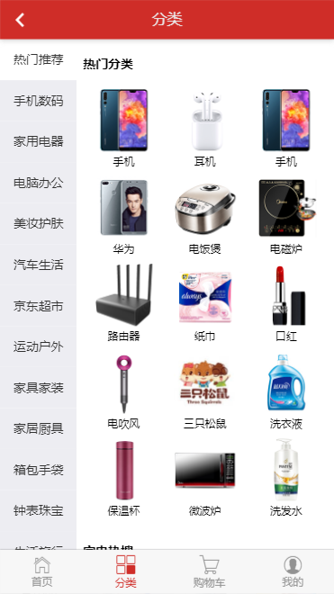
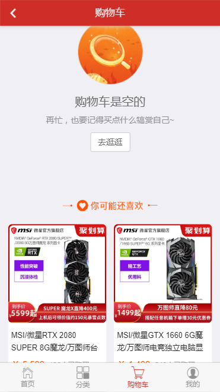
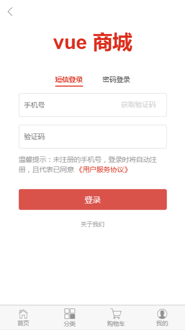
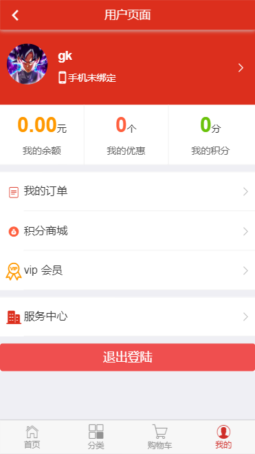

# 基于 vue-cli 3 开发的移动端项目

#### 项目使用的是静态资源和 Mock 虚拟数据，参照的是京东移动端首页与淘宝商品详情页购物车页；
### 仅登录功能需要用到的后台服务器地址：https://github.com/icedesert/takeaway_server







## Project setup
```
npm install
```

### Compiles and hot-reloads for development
```
npm run serve
```

### Compiles and minifies for production
```
npm run build
```

### Run your tests
```
npm run test
```

### Lints and fixes files
```
npm run lint
```

### Customize configuration
See [Configuration Reference](https://cli.vuejs.org/config/).
